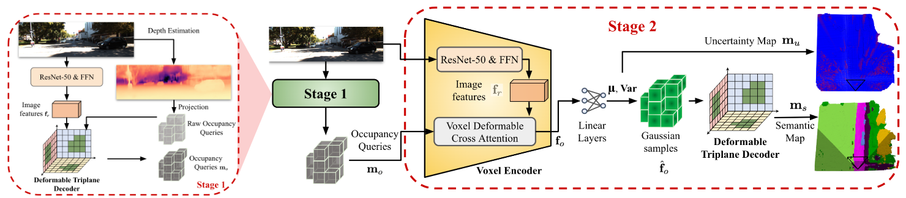

<div align="center">   
  
# ET-Former: Efficient Triplane Deformable Attention for 3D Semantic Scene Completion From Monocular Camera
</div>


[//]: # (> **ET-Former: Efficient Triplane Deformable Attention for 3D Semantic Scene Completion From Monocular Camera**.)

> [Jing Liang](https://jingliangc.github.io/), [He Yin](https://scholar.google.com/citations?hl=en&user=hKMVC8IAAAAJ), [Xuewei Qi](https://scholar.google.com/citations?hl=en&user=pOA6uKMAAAAJ&view_op=list_works&sortby=pubdate), [Jong Jin Park](https://scholar.google.com/citations?user=W-W1ew4AAAAJ), [Min Sun](https://scholar.google.com/citations?user=1Rf6sGcAAAAJ), [Min Sun](https://scholar.google.com/citations?user=1Rf6sGcAAAAJ), [Rajasimman Madhivanan](https://www.amazon.science/author/rajasimman-madhivanan), [Dinesh Manocha](https://scholar.google.com/citations?user=X08l_4IAAAAJ)


>  [[PDF]](https://arxiv.org/abs/2410.11019) [[Project]](https://github.com/jingGM/ET-Former.git) [[Intro Video]](https://youtu.be/aXnddiGxag0) [[Official Code]](https://github.com/amazon-science/ET-Former)


## News
- [2025/02]: We submitted the paper to IROS 2025;
- [2025/06]: Our paper is accepeted by IROS 2025;
</br>


## Abstract
We introduce ET-Former, a novel end-to-end algorithm for semantic scene completion using a single monocular camera. Our approach generates a semantic occupancy map from single RGB observation while simultaneously providing uncertainty estimates for semantic predictions. By designing a triplane-based deformable attention mechanism, our approach improves geometric understanding of the scene than other SOTA approaches and reduces noise in semantic predictions. Additionally, through the use of a Conditional Variational AutoEncoder (CVAE), we estimate the uncertainties of these predictions. The generated semantic and uncertainty maps will help formulate navigation strategies that facilitate safe and permissible decision making in the future. Evaluated on the Semantic-KITTI dataset, ET-Former achieves the highest Intersection over Union (IoU) and mean IoU (mIoU) scores while maintaining the lowest GPU memory usage, surpassing state-of-the-art (SOTA) methods. It improves the SOTA scores of IoU from 44.71 to 51.49 and mIoU from 15.04 to 16.30 on SeamnticKITTI test, with a notably low training memory consumption of 10.9 GB.

## Method

|                                                                                                                                                                                                                                                                                                                                                                                                                                                                                                                                                                                                                                                                                                                                                            | 
|:-------------------------------------------------------------------------------------------------------------------------------------------------------------------------------------------------------------------------------------------------------------------------------------------------------------------------------------------------------------------------------------------------------------------------------------------------------------------------------------------------------------------------------------------------------------------------------------------------------------------------------------------------------------------------------------------------------------------------------------------------------------------------------------------------:| 
| ***Figure 1. Overall Architecture of ET-Former**. We present a two-stage pipeline for processing mono-cam images and generate both a semantic occupancy map m_s and its corresponding uncertainty map m_u. In stage 1, we introduce a novel triplane-based deformable attention model to generate the occupancy queries m_o from the given mono-cam images, which reduces high-dimensional 3D feature processing to 2D computations. In stage 2, we employ the efficient triplane-based deformable attention mechanism to generate the semantic map, with the inferred voxels from stage 1 as input and conditioned on the RGB image. To estimate the uncertainty in the semantic map, we incorporate a CVAE method, and quantify the uncertainty using the variance of the CVAE latent samples.* |

## Installation
```
conda create -n etformer python=3.10
conda activate etformer
conda install pytorch==2.0.0 torchvision==0.15.0 pytorch-cuda=11.8 -c pytorch -c nvidia
pip3 install mmcv-full -f https://download.openmmlab.com/mmcv/dist/cu118/torch2.0/index.html
pip3 install torch-scatter -f https://data.pyg.org/whl/torch-2.0.0+cu118.html
pip3 install spconv-cu118
pip3 install -r requirements.txt

# Check the correct version: https://shi-labs.com/natten/wheels/
pip3 install natten==0.14.6+torch200cu118 -f https://shi-labs.com/natten/wheels/

pip3 install -v -e submodules/deform_attn_3d/
```

## Dataset

- [x] SemanticKITTI

Download datasets: The dataset preparation is from [VoxFormer](https://github.com/NVlabs/VoxFormer/blob/main/docs/prepare_dataset.md). Their links are not working well, please run their code to generate the ground truth and queries.
-  The **semantic scene completion dataset v1.1, odometery data, poses** (SemanticKITTI voxel data, 700 MB) from [SemanticKITTI website](http://www.semantic-kitti.org/dataset.html#download).
-  The **RGB images** (Download odometry data set (color, 65 GB)) from [KITTI Odometry website](http://www.cvlibs.net/datasets/kitti/eval_odometry.php).
-  The **calibration and pose** files from voxformer/preprocess/data_odometry_calib/sequences.
-  The **preprocessed ground truth** (~700MB) from [labels](https://drive.google.com/file/d/1r6RWjPClt9-EBbuOczLB295c00o7pOOP/view?usp=share_link).
-  The **voxelized psuedo point cloud** and **query proposals** (~400MB) based on MobileStereoNet from [sequences_msnet3d_sweep10](https://drive.google.com/file/d/1nxWC3z4D4LDboQoMA-mnlJ7QHUnR9gRn/view?usp=share_link).

preprocess targets:
```
python preprocess_data.py --data_root="DATA_ROOT_kitti_folder" --data_config="data/semantic_kitti/semantic-kitti.yaml" --batch=1 --index=0 --type=0
```

## Download Pretrained Models
```commandline
mkdir pretrained_models
cd pretrained_models
```
download [StageOne](https://drive.google.com/file/d/1fVxfhIgrVkoWvfWWFgVBOl5E5f3sXzbq/view?usp=sharing) and [StageTwo](https://drive.google.com/file/d/1ifkShR71gS7nv33pgQg7JG4JOwSUqc3p/view?usp=sharing)

## Training
Train stage one:
```
python3 -m torch.distributed.launch --nproc_per_node=4 main.py --only_load_model --model_type=3 --data_cfg="data/semantic_kitti/semantic-kitti.yaml" --snapshot="pretrained_models/stage1.pth" --data_root="DATA_ROOT_kitti_folder" --batch_size=1 --wandb_api="W&B api" --wandb_proj="W&B project name"
```

Generate data for the 2nd stage:
```
python3 evaluate.py --data_cfg="data/semantic_kitti/semantic-kitti.yaml" --model_type=3 --data_root="DATA_ROOT_kitti_folder" --batch_size=1 --snapshot="pretrained_models/stage1.pth" --generate_data
```

Train stage two:
```
python3 -m torch.distributed.launch --nproc_per_node=4 main.py --only_load_model --model_type=2 --data_cfg="data/semantic_kitti/semantic-kitti.yaml" --snapshot="pretrained_models/stage2.pth" --data_root="DATA_ROOT_kitti_folder" --batch_size=1 --wandb_api="W&B api" --wandb_proj="W&B project name"
```


## Evaluation
Evaluate stage one:
```
python3 evaluate.py --data_cfg="data/semantic_kitti/semantic-kitti.yaml" --model_type=3 --data_root="DATA_ROOT_kitti_folder" --batch_size=1 --snapshot="pretrained_models/stage1.pth"
```
Evaluate stage two:
```
python3 evaluate.py --data_cfg="data/semantic_kitti/semantic-kitti.yaml" --model_type=2 --data_root="DATA_ROOT_kitti_folder" --batch_size=1 --snapshot="pretrained_models/stage2.pth"
```

## Bibtex
If this work is helpful for your research, please cite the following BibTeX entry.

```
@inproceedings{liang2024etformer,
      title={ET-Former: Efficient Triplane Deformable Attention for 3D Semantic Scene Completion From Monocular Camera}, 
      author={\textbf{Jing Liang} and He Yin and Xuewei Qi and Jong Jin Park and Min Sun and Rajasimman Madhivanan and Dinesh Manocha},
  booktitle={2025 IEEE/RSJ International Conference on Intelligent Robots and Systems (IROS)},
  year={2025},
  organization={IEEE}
}
```


## Acknowledgement

Many thanks to these excellent open source projects:
- [MonoScene](https://github.com/astra-vision/MonoScene)
- [VoxFormer](https://github.com/NVlabs/VoxFormer)
